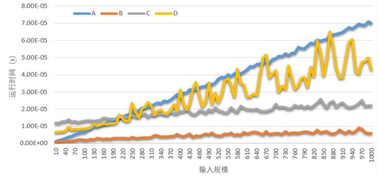
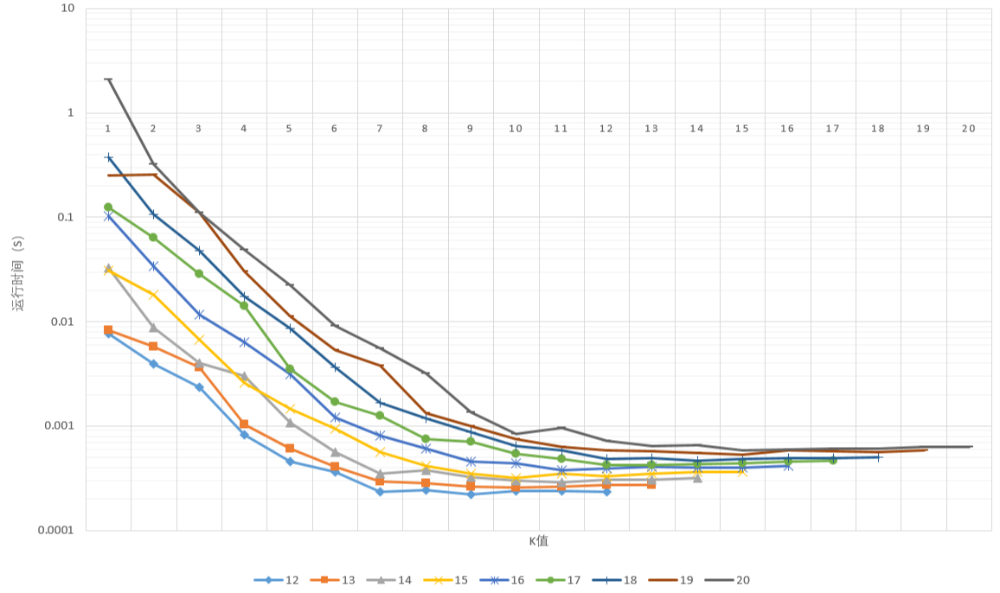

### P20

**若将$y\leftarrow uniform(0,1) $改为$y\leftarrow x$，则上述算法估计的值是什么？**

更改后算法变为在直线$y=x$上从$(0,0)$到$(1,1)$的采样，$k$值为落入以原点为圆心半径为1的圆的样本个数，所以算法估计的值为
$$
\frac{4k}{n}=\frac{4}{\sqrt{2}}=2\sqrt{2}
$$

### P23

**在机器上用$4\int_0^1{\sqrt{1-x^2}}dx$估计$\pi$值，给出不同的n值及精度**

| n | 估计值 | 绝对误差 |
| ---- | ---- | ---- |
|1e+06|3.1396|0.00199265|
|1e+07|3.14211|0.000522146|
|1e+08|3.14176|0.000171786|
|1e+09|3.14162|2.99344e-05|

**设$a$、 $b$、 $c$和$d$是实数，且$a ≤ b$，$c ≤ d$， $f:[a, b] \rightarrow [c, d]$是一个连续函数，写一概率算法计算积分$\int_a^b{f(x) dx}$**

```c++
typedef double (*Function)(double);

double EvaluateIntFunction(
    Function Func, double A, double B, double C, double D, int NumSamples)
{
    int HitCount = 0;
    default_random_engine Generator;
    uniform_real_distribution<double> UniformX(A, B);

    double YMax = max(D, 0.0);
    double YMin = min(C, 0.0);

    uniform_real_distribution<double> UniformY(YMin, YMax);

    for (size_t I = 0; I < NumSamples; I++)
    {
        double X = UniformX(Generator);
        double Y = UniformY(Generator);

        if (Y > 0 && Y <= Func(X))
        {
            HitCount += 1;
        }
        else if (Y < 0 && Y >= Func(X))
        {
            HitCount -= 1;
        }
    }

    double Area = (B - A) * (YMax - YMin);

    return static_cast<double>(HitCount) /
           static_cast<double>(NumSamples) * Area;
}
```

选取三个连续函数$exp(x)$、$sqrt(x)$和$sin(x)$进行测试，测试结果如下。其中真实值直接由积分后函数计算得出。

| 函数 | n    | 估计值 | 真实值 |
| ---- | ---- | ------ | ------ |
|Exp|1e+06|17.3638|17.3673|
|Sqrt|1e+06|2.79884|2.79743|
|Sin|1e+06|1.53159|1.53029|
|Exp|1e+07|17.3634|17.3673|
|Sqrt|1e+07|2.79725|2.79743|
|Sin|1e+07|1.53091|1.53029|
|Exp|1e+08|17.3669|17.3673|
|Sqrt|1e+08|2.79719|2.79743|
|Sin|1e+08|1.53047|1.53029|
|Exp|1e+09|17.3678|17.3673|
|Sqrt|1e+09|2.79744|2.79743|
|Sin|1e+09|1.53029|1.53029|

### P24

**设$\epsilon$，$\delta$是$(0,1)$之间的常数，证明：若$I$是$\int_0^1{f(x)dx}$的正确值，$h$是由HitorMiss算法返回的值，则当$n \ge \frac{I(1-I)}{\epsilon^2 {\delta} }$，有$P(|h-I| \lt \epsilon)\ge 1 - {\delta} $**

$\because P(|h-I|\lt\epsilon)=1-P(|h-I|\ge\epsilon)\ge1-\delta$

$\therefore$问题等价于证明当$n \ge \frac{I(1-I)}{\epsilon^2 {\delta} }$时，有$P(|h-I|\ge \epsilon)\le \delta$

设随机变量$H$表示HitorMiss算法返回值，随机变量$X$表示HitorMiss中每次随机采样值，取值范围为$\{0，1\}$

两者满足$H=nX$，其中$E(X)=I$，$Var(X)=I(1-I)$，$Var(H)=\frac{Var(X)}{n}$

考虑切比雪夫不等式$P(|H-I|\ge \epsilon)\le \frac{Var(H)}{\epsilon^2}$，其中$\epsilon $为$(0,1)$之间的常数

当$n \ge \frac{I(1-I)}{\epsilon^2 {\delta} }$时，$Var(H)\le\epsilon^2\delta$，从而$P(|H-I|\ge \epsilon)\le \frac{Var(H)}{\epsilon^2}\le\delta$

### P36

运行算法10000次求K值期望，然后利用K值均值估计集合的势。由下表可知，n值越大，估计值越准确。原因是算法中使用的$k=\sqrt{n\pi/2}$当且仅当n趋近于无穷大时成立，当n越大该估计就越准确。

| n | 估计值 | 相对误差 |
| ---- | ---- | ---- |
|10|5.72958|0.427042|
|100|91.6732|0.0832675|
|1000|919.279|0.080721|
|10000|9788.67|0.0211334|
|100000|100337|0.00337006|

代码如下

```c++
#define _USE_MATH_DEFINES
#include <cmath>
#include <unordered_set>
#include <random>
#include <iostream>
#include <chrono>

using namespace std;
using namespace std::chrono;

int SetCount(int N)
{
    int K = 0;
    unordered_set<int> S;

    unsigned Seed = system_clock::now().time_since_epoch().count();
    default_random_engine Generator(Seed);
    uniform_int_distribution<int> Uniform(1, N);

    int A = Uniform(Generator);

    do
    {
        K += 1;
        S.insert(A);
        A = Uniform(Generator);
    } while (S.find(A) == S.end());

    return K;
}

int main(int argc, char const *argv[])
{
    const int Repeat = 10000;

    for (int I = 10; I < 1000000; I *= 10)
    {
        int K = 0;
        for (int J = 0; J < Repeat; J++)
        {
            K += SetCount(I);
        }
        K /= Repeat;
        double N = 2.0 * pow(K, 2) / M_PI;
        cout << I << "," << N << "," << fabs(N - I) / I << endl;
    }

    return 0;
}
```

### P54

**分析dlogRH的工作原理，指出该算法相应的u和v**

随机抽样函数
$$
r=uniform(0\dots p-2)
$$
输入实例到随机化实例映射
$$
u(g,a,p,r) = (a(g^r\ mod\ p))\ mod\ p
$$
随机化实例输出到原实例输出映射
$$
v(y,r,p)=(y-r)\ mod\ (p-1)
$$
原理
$$
((g^r\ mod\ p)(g^x\ mod\ p))\ mod\ p=g^{x+r}\ mod\ p = c\\
log_{p,g}c=x+r=y\\
x=(y-r)\ mod\ (p-1)
$$

### P67

下表为在不同输入规模下四种搜索算法的运行时间节选。

| n | A(s) | B(s) | C(s) | D(s) |
| ---- | ---- | ---- | ---- | ---- |
|1e1|4.5e-08|1.08e-07|7.488e-06|7.18e-06|
|1e2|1.03e-07|8.2e-08|7.878e-06|7.322e-06|
|1e3|1.547e-06|2.13e-07|9.961e-06|8.024e-06|
|1e4|5.714e-06|3.73e-07|1.3176e-05|1.2935e-05|
|1e5|0.00012115|1.12e-06|2.589e-05|0.00012864|

此外取输入规模从10到1000，间隔为10分别运行四种搜索算法得到下图。A算法时间复杂度为$\Theta (n)$。B随机算法时间性能优于A算法，但时间复杂度仍旧是$O(n)$。确定性算法D时间复杂度明显优于A和B，平均时间复杂度符合理论上的$\Theta(n)$。在D算法基础上修改的Sherwood算法C时间复杂度同为$\Theta(n)$，因为Sherwood算法的目标是平滑不同输入实例的算法运行时间而不是提升平均运行时间，而且为了该目的往往会引入额外的时间开销，图中C和D两条曲线的相对位置印证了这一点。



C算法代码如下：

```c++
int C(int X)
{
    default_random_engine Generator;
    uniform_int_distribution<int> Uniform(0, Size - 1);

    int I = Head;
    int Max = numeric_limits<int>::min();
    int Cnt = (int)ceil(sqrt(Size));

    for (int J = 0; J < Cnt; J++)
    {
        int K = Uniform(Generator);
        int Y = Val[K];
        if (Y > Max && Y <= X)
        {
            I = K;
            Max = Y;
        }
    }

    return Search(X, I);
}
```

### P83



上图为随机算法求解N皇后问题在不同输入规模下使用不同K值的时间性能，下表给出了各输入规模下最优K值。

|输入规模| 12   | 13   | 14   | 15   | 16   | 17   | 18   | 19   | 20   |
| ---- | ---- | ---- | ---- | ---- | ---- | ---- | ---- | ---- | ---- |
| 最优K值| 8    | 9    | 10   | 9    | 10   | 11   | 13   | 14   | 14   |

### P147

**将下面基于概率的素数寻找算法与确定性算法相比较，并给出100~10000以内错误的比例。**

```
PrintPrimes{  //打印1万以内的素数
    print 2，3；
    n gets 5；
    repeat
    if RepeatMillRab(n, floor(log(n)))  then print n;
    n gets n+2;
    until  n=10000;
}
```

两种算法在0-10000以内均找出1229个素数，也就是说概率算法寻找100~10000以内算法没有发生错误。但是在运行时间方面，概率算法要远慢于确定性算法，一个很可能的原因是在Btest函数中pow运算涉及大整数计算，该类计算由字符串实现高精度计算拖慢了整体的时间性能。

### P30

**$G$中最大团的大小为α当且仅当$G_m$里最大团的大小是mα**

要证明该问题，需要分别证明如下四个命题：

1. $G$中有大小为$\alpha$的团时，$G_m$中有大小为$m\alpha$的团
2. $G_m$中有大小为$m\alpha$的团时，$G$中有大小为$\alpha$的团
3. $G$中没有大小为$\alpha+1$的团时，$G_m$中没有大小为$m\alpha+1$的团
4. $G_m$中没有大小为$m\alpha+1$的团时，$G$中没有大小为$\alpha+1$的团

下面依次对这四个命题进行证明：

1. 假设$G$中存在大小为$\alpha$的团$\{V_1,V_2,\dots,V_\alpha\}$，则$G_m$中对应的顶点集合为$\{V_{11},V_{12},\dots,V_{1m},V_{21},V_{22},\dots,V_{2m},\dots,V_{\alpha1},V_{\alpha2},\dots,V_{\alpha m}\}$。要证$\{V_{ij}\},i=1\dots\alpha,j=1\dots m$是团。任取两个顶点$V_{i_1j_1}$和$V_{i_2j_2}$，若$j_1= j_2$，则这两个顶点属于同一个副本，由于原本$G$中$\{V_1,V_2,\dots,V_\alpha\}$是团，$V_{i_1}$和$V_{i_2}$在原本中相邻，故$V_{i_1j_1}$和$V_{i_2j_2}$相邻。若$j_1\ne  j_2$，则这两个顶点属于原本的不同副本，由$G_m$的定义可知$V_{i_1j_1}$和$V_{i_2j_2}$相邻。
2. 假设$G_m$中由大小为$m\alpha$的团，团的顶点分布在原本的m个副本中的数量分别为$c_1,c_2,\dots,c_m$，则抽屉原理可知至少有一个副本中占据了$\alpha$个顶点，这$\alpha$个顶点在$G_m$中是团，由$G_m$定义可知在$G$中也是团。
3. 证明逆否命题：$G_m​$中有大小为$m\alpha+1​$的团时，$G​$中有大小为$\alpha+1​$的团。由抽屉原理可知构成$G_m​$中构成团的$m\alpha+1​$个顶点至少有$\alpha+1​$个顶点属于原本的同一个副本，这$\alpha+1​$个顶点在$G_m​$中是团，由$G_m​$定义可知在$G​$中也是团。
4. 证明逆否命题：$G$中有大小为$\alpha+1$的团时，$G_m$中有大小为$m\alpha+1$的团。由命题1可知，当$G$中有大小为$\alpha+1$的团时，$G_m$中有大小为$m(\alpha+1)$的团，从该团中任取$m\alpha+1$个顶点就是一个团。

### P41

**证明当最优调度在任何机器上至多包含2个作业时，LPT也是最优的。**

不妨设$n=2m$，若$n<2m$，则令$J_{n+1},…,J_{2m}$的时间均为0，将其加入$I$，不妨设$P_1≥P_2≥… ≥ P_{2m}$

设最优调度使得每台机器恰有2个作业：$J_i$和$J_j$，则必有$i≤m$，$j＞m$。

否则若某最优调度O有$i,j≤m$，则定有某台机器上有$J_s$和$J_t$，使得$s,t>m$。

$\because P_i,P_j≥P_s,P_t$，交换$P_j$和$P_t$，有$P_i+P_t≤P_i+P_j$和$P_s+P_j≤P_i+P_j$

$\therefore$交换后的调度O’的最迟完成时间只可能减少，故O’也是最优调度。

$\therefore$必有最优调度使$J_1,...,J_m$分别分配到$M_1,…,M_m$上（前提），在该前提下将$J_{m+1},...,J_{2m}$分配到$M$台机器上时，LPT是将长时间的作业分配到轻负载上，即$J_{m+1}$分配到$M_m$上，$J_{m+2}$分配到$M_{m-1}$上，$...$，$J_{2m}$分配到$M_1$上。这是在给定前提下，使得整体最优的$J_{m+1},...,J_{2m}$调度方案。该调度方案与上述最优调度方案一致。